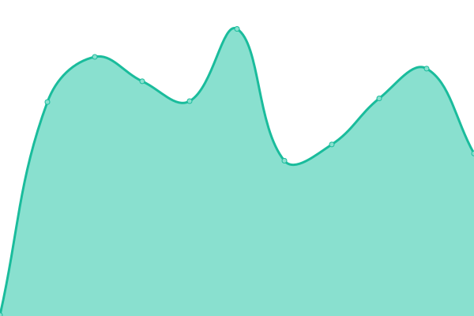
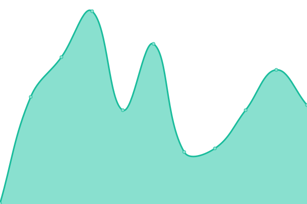
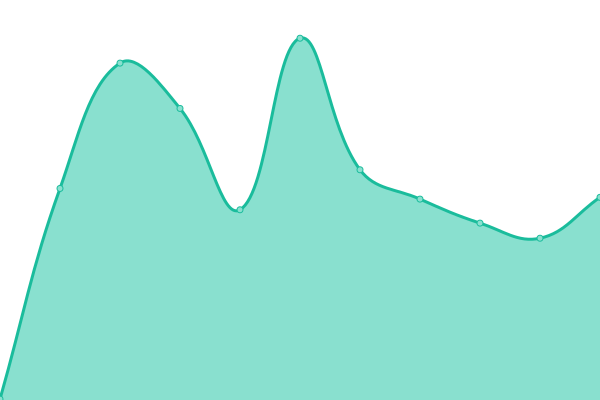
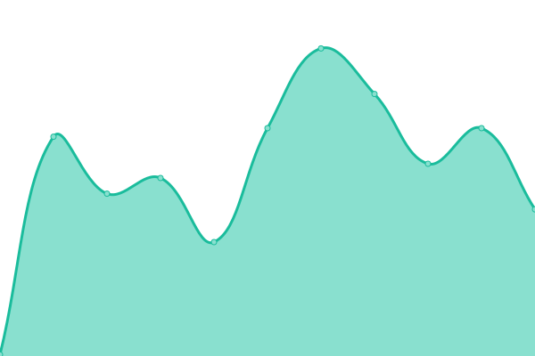
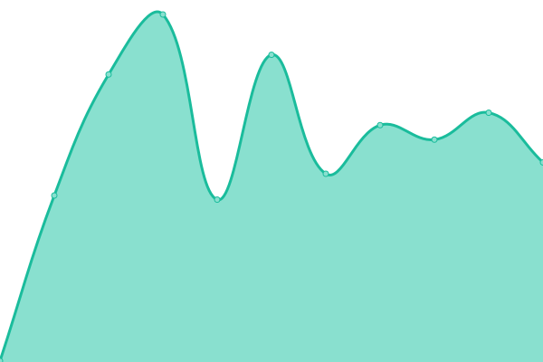
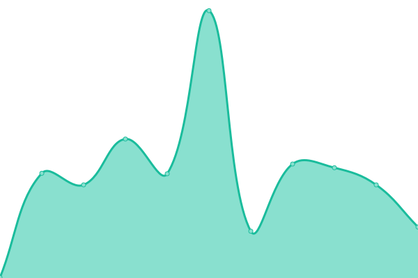
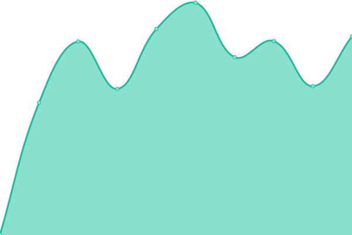
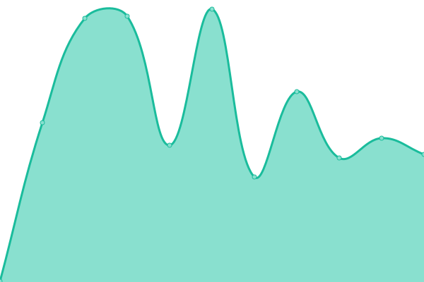
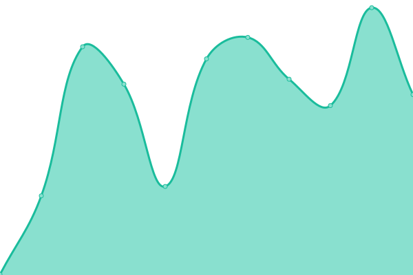

# [📈 Live Status](https://demo.upptime.js.org): <!--live status--> **🟧 Partial outage**

This repository contains the open-source uptime monitor and status page for [Upptime](https://upptime.js.org), powered by [Upptime](https://github.com/upptime/upptime).

With [Upptime](https://upptime.js.org), you can get your own unlimited and free uptime monitor and status page, powered entirely by a GitHub repository. We use [Issues](https://github.com/upptime/upptime/issues) as incident reports, [Actions](https://github.com/upptime/upptime/actions) as uptime monitors, and [Pages](https://demo.upptime.js.org) for the status page.

<!--start: status pages-->
<!-- This summary is generated by Upptime (https://github.com/upptime/upptime) -->
<!-- Do not edit this manually, your changes will be overwritten -->

| URL                                                            | Status  | History                                                                                                                   | Response Time                                                                                | Uptime                                                                                                                                                                                                                                                   |
| -------------------------------------------------------------- | ------- | ------------------------------------------------------------------------------------------------------------------------- | -------------------------------------------------------------------------------------------- | -------------------------------------------------------------------------------------------------------------------------------------------------------------------------------------------------------------------------------------------------------- |
| [100diasdeverano](https://100diasdeverano.com)                 | 🟩 Up   | [100diasdeverano.yml](https://github.com/compusam/upckmonitor/commits/master/history/100diasdeverano.yml)                 |  232ms         |                  |
| [Agristarcontigo](https://agristarcontigo.com)                 | 🟩 Up   | [agristarcontigo.yml](https://github.com/compusam/upckmonitor/commits/master/history/agristarcontigo.yml)                 |  201ms         |                  |
| [CelebraconCRE](https://celebraconcre.com)                     | 🟩 Up   | [celebracon-cre.yml](https://github.com/compusam/upckmonitor/commits/master/history/celebracon-cre.yml)                   |  2106ms         |                    |
| [Circulodehonorapp](https://circulodehonorapp.com)             | 🟩 Up   | [circulodehonorapp.yml](https://github.com/compusam/upckmonitor/commits/master/history/circulodehonorapp.yml)             |  634ms       |              |
| [Clubdeganadoresmayoreo](https://clubdeganadoresmayoreo.com)   | 🟩 Up   | [clubdeganadoresmayoreo.yml](https://github.com/compusam/upckmonitor/commits/master/history/clubdeganadoresmayoreo.yml)   |  269ms  |    |
| [CNV](https://circulodehonorpepsico.com)                       | 🟩 Up   | [cnv.yml](https://github.com/compusam/upckmonitor/commits/master/history/cnv.yml)                                         |  479ms                     |                                           |
| [Conexionescollins](https://conexionescollins.com)             | 🟩 Up   | [conexionescollins.yml](https://github.com/compusam/upckmonitor/commits/master/history/conexionescollins.yml)             |  237ms       |              |
| [Contpaqistore](https://contpaqistore.com)                     | 🟩 Up   | [contpaqistore.yml](https://github.com/compusam/upckmonitor/commits/master/history/contpaqistore.yml)                     |  215ms           |                      |
| [DbaRewards](https://dbarewards.com)                           | 🟩 Up   | [dba-rewards.yml](https://github.com/compusam/upckmonitor/commits/master/history/dba-rewards.yml)                         |  276ms             |                          |
| [DesafioPepsico](https://desafiopepsico.com)                   | 🟩 Up   | [desafio-pepsico.yml](https://github.com/compusam/upckmonitor/commits/master/history/desafio-pepsico.yml)                 |  159ms         |                   |
| [Diageobaracademy](https://diageobaracademymexico.com)         | 🟩 Up   | [diageobaracademy.yml](https://github.com/compusam/upckmonitor/commits/master/history/diageobaracademy.yml)               |  158ms        |                |
| [Enlacechopo](https://enlacechopo.com.mx)                      | 🟩 Up   | [enlacechopo.yml](https://github.com/compusam/upckmonitor/commits/master/history/enlacechopo.yml)                         |  249ms             |                          |
| [Erewardsmx](https://erewardsmx.com)                           | 🟩 Up   | [erewardsmx.yml](https://github.com/compusam/upckmonitor/commits/master/history/erewardsmx.yml)                           |  839ms              |                             |
| [GMF](https://clubroyalelite.com)                              | 🟩 Up   | [gmf.yml](https://github.com/compusam/upckmonitor/commits/master/history/gmf.yml)                                         |  244ms                     |                                          |
| [Honorpremia](https://honorpremia.com)                         | 🟩 Up   | [honorpremia.yml](https://github.com/compusam/upckmonitor/commits/master/history/honorpremia.yml)                         |  548ms             |                           |
| [Jacto](https://jactopremios.com)                              | 🟩 Up   | [jacto.yml](https://github.com/compusam/upckmonitor/commits/master/history/jacto.yml)                                     |  697ms                   |                                      |
| [Liberatubelleza](https://liberatubelleza.com.mx)              | 🟩 Up   | [liberatubelleza.yml](https://github.com/compusam/upckmonitor/commits/master/history/liberatubelleza.yml)                 |  289ms         |                  |
| [Lidereshell](https://liderescs.com.mx)                        | 🟥 Down | [lidereshell.yml](https://github.com/compusam/upckmonitor/commits/master/history/lidereshell.yml)                         |  0ms               |                           |
| [Lubechampions](https://lubechampions.com.mx)                  | 🟩 Up   | [lubechampions.yml](https://github.com/compusam/upckmonitor/commits/master/history/lubechampions.yml)                     |  250ms           |                      |
| [Mayre](https://recompensasmayre.com)                          | 🟩 Up   | [mayre.yml](https://github.com/compusam/upckmonitor/commits/master/history/mayre.yml)                                     |  294ms                   |                                      |
| [Motivale](http://motivale.com)                                | 🟩 Up   | [motivale.yml](https://github.com/compusam/upckmonitor/commits/master/history/motivale.yml)                               |  354ms                |                                 |
| [Premianavidad](https://premianavidadpepsico.com)              | 🟥 Down | [premianavidad.yml](https://github.com/compusam/upckmonitor/commits/master/history/premianavidad.yml)                     |  0ms             |                       |
| [Programaclubdeganadores](https://programaclubdeganadores.com) | 🟩 Up   | [programaclubdeganadores.yml](https://github.com/compusam/upckmonitor/commits/master/history/programaclubdeganadores.yml) |  271ms |  |
| [Programapremianavidad](https://programapremianavidad.com)     | 🟥 Down | [programapremianavidad.yml](https://github.com/compusam/upckmonitor/commits/master/history/programapremianavidad.yml)     |  0ms     |       |
| [Programasocioestrella](https://programasocioestrella.com)     | 🟩 Up   | [programasocioestrella.yml](https://github.com/compusam/upckmonitor/commits/master/history/programasocioestrella.yml)     |  341ms   |      |
| [Promoshopclarios](https://promoshopclarios.com.mx)            | 🟩 Up   | [promoshopclarios.yml](https://github.com/compusam/upckmonitor/commits/master/history/promoshopclarios.yml)               |  222ms        |                |
| [Raisingthebar](https://raisingthebarmexico.mx)                | 🟩 Up   | [raisingthebar.yml](https://github.com/compusam/upckmonitor/commits/master/history/raisingthebar.yml)                     |  195ms           |                       |
| [Recibetucodigo](https://recibetucodigo.com)                   | 🟩 Up   | [recibetucodigo.yml](https://github.com/compusam/upckmonitor/commits/master/history/recibetucodigo.yml)                   |  306ms          |                    |
| [Recompensamostulealtad](https://recompensamostulealtad.com)   | 🟩 Up   | [recompensamostulealtad.yml](https://github.com/compusam/upckmonitor/commits/master/history/recompensamostulealtad.yml)   |  234ms  |    |
| [Redrewards](https://redrewards.mx)                            | 🟩 Up   | [redrewards.yml](https://github.com/compusam/upckmonitor/commits/master/history/redrewards.yml)                           |  229ms              |                            |
| [SocioPepsico](https://sociopepsicomexico.com)                 | 🟩 Up   | [socio-pepsico.yml](https://github.com/compusam/upckmonitor/commits/master/history/socio-pepsico.yml)                     |  606ms           |                      |
| [Spionline](https://spi-online.com)                            | 🟥 Down | [spionline.yml](https://github.com/compusam/upckmonitor/commits/master/history/spionline.yml)                             |  0ms                 |                               |
| [SuperacionJD](https://superacionjd.com)                       | 🟥 Down | [superacion-jd.yml](https://github.com/compusam/upckmonitor/commits/master/history/superacion-jd.yml)                     |  0ms             |                       |
| [Urreapremia](https://urreapremia.com)                         | 🟩 Up   | [urreapremia.yml](https://github.com/compusam/upckmonitor/commits/master/history/urreapremia.yml)                         |  322ms             |                          |

<!--end: status pages-->

[**Visit our status website →**](https://demo.upptime.js.org)

## 📄 License

- Code: [MIT](./LICENSE) © [Upptime](https://upptime.js.org)
- Data in the `./history` directory: [Open Database License](https://opendatacommons.org/licenses/odbl/1-0/)
