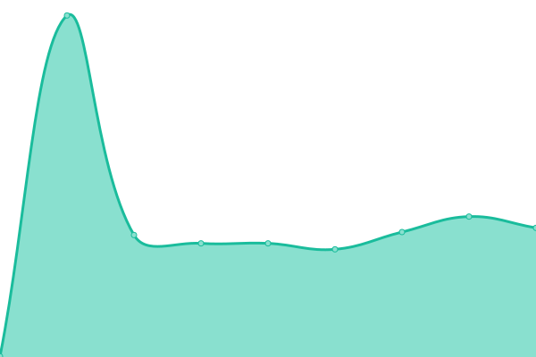

# [📈 Live Status](https://demo.upptime.js.org): <!--live status--> **🟧 Partial outage**

This repository contains the open-source uptime monitor and status page for [Upptime](https://upptime.js.org), powered by [Upptime](https://github.com/upptime/upptime).

With [Upptime](https://upptime.js.org), you can get your own unlimited and free uptime monitor and status page, powered entirely by a GitHub repository. We use [Issues](https://github.com/upptime/upptime/issues) as incident reports, [Actions](https://github.com/upptime/upptime/actions) as uptime monitors, and [Pages](https://demo.upptime.js.org) for the status page.

<!--start: status pages-->
<!-- This summary is generated by Upptime (https://github.com/upptime/upptime) -->
<!-- Do not edit this manually, your changes will be overwritten -->
<!-- prettier-ignore -->
| URL | Status | History | Response Time | Uptime |
| --- | ------ | ------- | ------------- | ------ |
|  [100diasdeverano](https://100diasdeverano.com) | 🟥 Down | [100diasdeverano.yml](https://github.com/compusam/upckmonitor/commits/HEAD/history/100diasdeverano.yml) | 

 0ms
     
 | 

<a href="https://compusam.github.io/upckmonitor/history/100diasdeverano">0.00%</a>
    

|  [Agristarcontigo](https://agristarcontigo.com) | 🟩 Up | [agristarcontigo.yml](https://github.com/compusam/upckmonitor/commits/HEAD/history/agristarcontigo.yml) | 

 178ms
     
 | 

<a href="https://compusam.github.io/upckmonitor/history/agristarcontigo">100.00%</a>
    

|  [CelebraconCRE](https://celebraconcre.com) | 🟩 Up | [celebracon-cre.yml](https://github.com/compusam/upckmonitor/commits/HEAD/history/celebracon-cre.yml) | 

 2153ms
     
 | 

<a href="https://compusam.github.io/upckmonitor/history/celebracon-cre">99.82%</a>
    

|  [Circulodehonorapp](https://circulodehonorapp.com) | 🟩 Up | [circulodehonorapp.yml](https://github.com/compusam/upckmonitor/commits/HEAD/history/circulodehonorapp.yml) | 

 206ms
     
 | 

<a href="https://compusam.github.io/upckmonitor/history/circulodehonorapp">100.00%</a>
    

|  [Clubdeganadoresmayoreo](https://clubdeganadoresmayoreo.com) | 🟩 Up | [clubdeganadoresmayoreo.yml](https://github.com/compusam/upckmonitor/commits/HEAD/history/clubdeganadoresmayoreo.yml) | 

 222ms
     
 | 

<a href="https://compusam.github.io/upckmonitor/history/clubdeganadoresmayoreo">100.00%</a>
    

|  [CNV](https://circulodehonorpepsico.com) | 🟩 Up | [cnv.yml](https://github.com/compusam/upckmonitor/commits/HEAD/history/cnv.yml) | 

 3079ms
     
 | 

<a href="https://compusam.github.io/upckmonitor/history/cnv">99.02%</a>
    

|  [Conexionescollins](https://conexionescollins.com) | 🟩 Up | [conexionescollins.yml](https://github.com/compusam/upckmonitor/commits/HEAD/history/conexionescollins.yml) | 

 198ms
     
 | 

<a href="https://compusam.github.io/upckmonitor/history/conexionescollins">100.00%</a>
    

|  [Contpaqistore](https://contpaqistore.com) | 🟥 Down | [contpaqistore.yml](https://github.com/compusam/upckmonitor/commits/HEAD/history/contpaqistore.yml) | 

 0ms
     
 | 

<a href="https://compusam.github.io/upckmonitor/history/contpaqistore">0.00%</a>
    

|  [DbaRewards](https://dbarewards.com) | 🟩 Up | [dba-rewards.yml](https://github.com/compusam/upckmonitor/commits/HEAD/history/dba-rewards.yml) | 

 216ms
     
 | 

<a href="https://compusam.github.io/upckmonitor/history/dba-rewards">100.00%</a>
    

|  [DesafioPepsico](https://desafiopepsico.com) | 🟩 Up | [desafio-pepsico.yml](https://github.com/compusam/upckmonitor/commits/HEAD/history/desafio-pepsico.yml) | 

 179ms
     
 | 

<a href="https://compusam.github.io/upckmonitor/history/desafio-pepsico">100.00%</a>
    

|  [Diageobaracademy](https://diageobaracademymexico.com) | 🟩 Up | [diageobaracademy.yml](https://github.com/compusam/upckmonitor/commits/HEAD/history/diageobaracademy.yml) | 

 151ms
     
 | 

<a href="https://compusam.github.io/upckmonitor/history/diageobaracademy">100.00%</a>
    

|  [Enlacechopo](https://enlacechopo.com.mx) | 🟩 Up | [enlacechopo.yml](https://github.com/compusam/upckmonitor/commits/HEAD/history/enlacechopo.yml) | 

 193ms
     
 | 

<a href="https://compusam.github.io/upckmonitor/history/enlacechopo">100.00%</a>
    

|  [Erewardsmx](https://erewardsmx.com) | 🟩 Up | [erewardsmx.yml](https://github.com/compusam/upckmonitor/commits/HEAD/history/erewardsmx.yml) | 

 835ms
     
 | 

<a href="https://compusam.github.io/upckmonitor/history/erewardsmx">99.62%</a>
    

|  [GMF](https://clubroyalelite.com) | 🟩 Up | [gmf.yml](https://github.com/compusam/upckmonitor/commits/HEAD/history/gmf.yml) | 

 176ms
     
 | 

<a href="https://compusam.github.io/upckmonitor/history/gmf">100.00%</a>
    

|  [Honorpremia](https://honorpremia.com) | 🟩 Up | [honorpremia.yml](https://github.com/compusam/upckmonitor/commits/HEAD/history/honorpremia.yml) | 

 398ms
     
 | 

<a href="https://compusam.github.io/upckmonitor/history/honorpremia">100.00%</a>
    

|  [Jacto](https://jactopremios.com) | 🟥 Down | [jacto.yml](https://github.com/compusam/upckmonitor/commits/HEAD/history/jacto.yml) | 

 0ms
     
 | 

<a href="https://compusam.github.io/upckmonitor/history/jacto">0.00%</a>
    

|  [Liberatubelleza](https://liberatubelleza.com.mx) | 🟩 Up | [liberatubelleza.yml](https://github.com/compusam/upckmonitor/commits/HEAD/history/liberatubelleza.yml) | 

 259ms
     
 | 

<a href="https://compusam.github.io/upckmonitor/history/liberatubelleza">100.00%</a>
    

|  [Lidereshell](https://liderescs.com.mx) | 🟥 Down | [lidereshell.yml](https://github.com/compusam/upckmonitor/commits/HEAD/history/lidereshell.yml) | 

 0ms
     
 | 

<a href="https://compusam.github.io/upckmonitor/history/lidereshell">100.00%</a>
    

|  [Lubechampions](https://lubechampions.com.mx) | 🟩 Up | [lubechampions.yml](https://github.com/compusam/upckmonitor/commits/HEAD/history/lubechampions.yml) | 

 190ms
     
 | 

<a href="https://compusam.github.io/upckmonitor/history/lubechampions">100.00%</a>
    

|  [Mayre](https://recompensasmayre.com) | 🟩 Up | [mayre.yml](https://github.com/compusam/upckmonitor/commits/HEAD/history/mayre.yml) | 

 134ms
     
 | 

<a href="https://compusam.github.io/upckmonitor/history/mayre">100.00%</a>
    

|  [Motivale](http://motivale.com) | 🟩 Up | [motivale.yml](https://github.com/compusam/upckmonitor/commits/HEAD/history/motivale.yml) | 

 495ms
     
 | 

<a href="https://compusam.github.io/upckmonitor/history/motivale">100.00%</a>
    

|  [Premianavidad](https://premianavidadpepsico.com) | 🟩 Up | [premianavidad.yml](https://github.com/compusam/upckmonitor/commits/HEAD/history/premianavidad.yml) | 

 187ms
     
 | 

<a href="https://compusam.github.io/upckmonitor/history/premianavidad">100.00%</a>
    

|  [Programaclubdeganadores](https://programaclubdeganadores.com) | 🟩 Up | [programaclubdeganadores.yml](https://github.com/compusam/upckmonitor/commits/HEAD/history/programaclubdeganadores.yml) | 

 209ms
     
 | 

<a href="https://compusam.github.io/upckmonitor/history/programaclubdeganadores">100.00%</a>
    

|  [Programapremianavidad](https://programapremianavidad.com) | 🟥 Down | [programapremianavidad.yml](https://github.com/compusam/upckmonitor/commits/HEAD/history/programapremianavidad.yml) | 

 0ms
     
 | 

<a href="https://compusam.github.io/upckmonitor/history/programapremianavidad">100.00%</a>
    

|  [Programasocioestrella](https://programasocioestrella.com) | 🟩 Up | [programasocioestrella.yml](https://github.com/compusam/upckmonitor/commits/HEAD/history/programasocioestrella.yml) | 

 318ms
     
 | 

<a href="https://compusam.github.io/upckmonitor/history/programasocioestrella">100.00%</a>
    

|  [Promoshopclarios](https://promoshopclarios.com.mx) | 🟩 Up | [promoshopclarios.yml](https://github.com/compusam/upckmonitor/commits/HEAD/history/promoshopclarios.yml) | 

 188ms
     
 | 

<a href="https://compusam.github.io/upckmonitor/history/promoshopclarios">100.00%</a>
    

|  [Raisingthebar](https://raisingthebarmexico.mx) | 🟩 Up | [raisingthebar.yml](https://github.com/compusam/upckmonitor/commits/HEAD/history/raisingthebar.yml) | 

 247ms
     
 | 

<a href="https://compusam.github.io/upckmonitor/history/raisingthebar">100.00%</a>
    

|  [Recibetucodigo](https://recibetucodigo.com) | 🟩 Up | [recibetucodigo.yml](https://github.com/compusam/upckmonitor/commits/HEAD/history/recibetucodigo.yml) | 

 196ms
     
 | 

<a href="https://compusam.github.io/upckmonitor/history/recibetucodigo">100.00%</a>
    

|  [Recompensamostulealtad](https://recompensamostulealtad.com) | 🟩 Up | [recompensamostulealtad.yml](https://github.com/compusam/upckmonitor/commits/HEAD/history/recompensamostulealtad.yml) | 

 173ms
     
 | 

<a href="https://compusam.github.io/upckmonitor/history/recompensamostulealtad">100.00%</a>
    

|  [Redrewards](https://redrewards.mx) | 🟩 Up | [redrewards.yml](https://github.com/compusam/upckmonitor/commits/HEAD/history/redrewards.yml) | 

 232ms
     
 | 

<a href="https://compusam.github.io/upckmonitor/history/redrewards">100.00%</a>
    

|  [SocioPepsico](https://sociopepsicomexico.com) | 🟩 Up | [socio-pepsico.yml](https://github.com/compusam/upckmonitor/commits/HEAD/history/socio-pepsico.yml) | 

 912ms
     
 | 

<a href="https://compusam.github.io/upckmonitor/history/socio-pepsico">100.00%</a>
    

|  [Spionline](https://spi-online.com) | 🟥 Down | [spionline.yml](https://github.com/compusam/upckmonitor/commits/HEAD/history/spionline.yml) | 

 0ms
     
 | 

<a href="https://compusam.github.io/upckmonitor/history/spionline">100.00%</a>
    

|  [SuperacionJD](https://superacionjd.com) | 🟩 Up | [superacion-jd.yml](https://github.com/compusam/upckmonitor/commits/HEAD/history/superacion-jd.yml) | 

 185ms
     
 | 

<a href="https://compusam.github.io/upckmonitor/history/superacion-jd">100.00%</a>
    

|  [Urreapremia](https://urreapremia.com) | 🟥 Down | [urreapremia.yml](https://github.com/compusam/upckmonitor/commits/HEAD/history/urreapremia.yml) | 

 0ms
     
 | 

<a href="https://compusam.github.io/upckmonitor/history/urreapremia">0.00%</a>
    

<!--end: status pages-->

[**Visit our status website →**](https://demo.upptime.js.org)

## 📄 License

- Code: [MIT](./LICENSE) © [Upptime](https://upptime.js.org)
- Data in the `./history` directory: [Open Database License](https://opendatacommons.org/licenses/odbl/1-0/)
