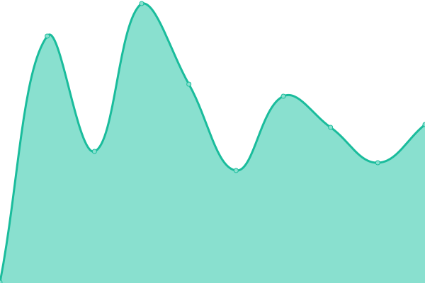
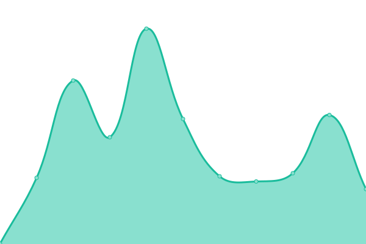
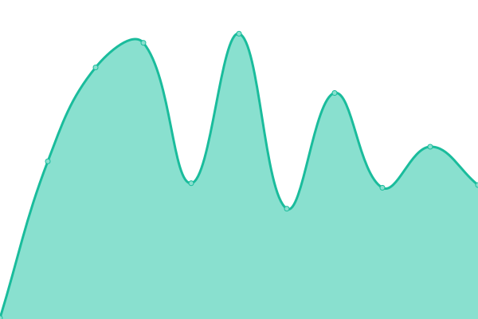
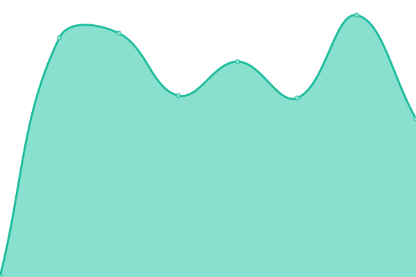
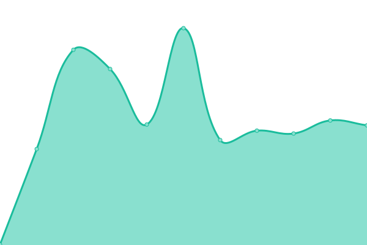
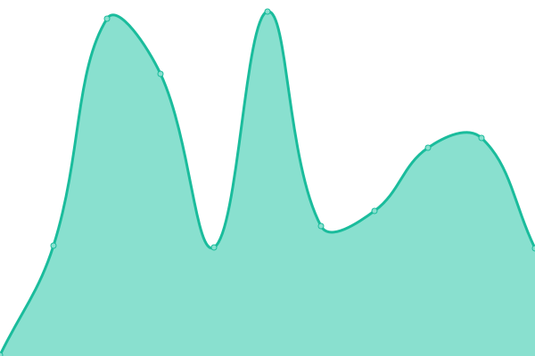
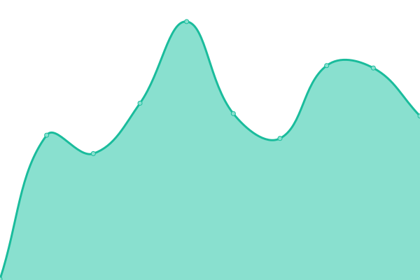
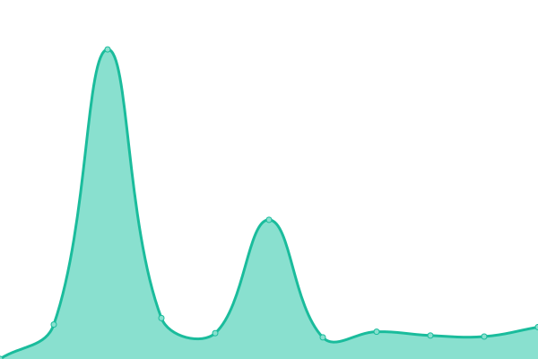

# [📈 Live Status](https://demo.upptime.js.org): <!--live status--> **🟨 Partial outage**

This repository contains the open-source uptime monitor and status page for [Upptime](https://upptime.js.org), powered by [Upptime](https://github.com/upptime/upptime).

With [Upptime](https://upptime.js.org), you can get your own unlimited and free uptime monitor and status page, powered entirely by a GitHub repository. We use [Issues](https://github.com/upptime/upptime/issues) as incident reports, [Actions](https://github.com/upptime/upptime/actions) as uptime monitors, and [Pages](https://demo.upptime.js.org) for the status page.

<!--start: status pages-->
<!-- This summary is generated by Upptime (https://github.com/upptime/upptime) -->
<!-- Do not edit this manually, your changes will be overwritten -->

| URL                                                            | Status  | History                                                                                                                   | Response Time                                                                                | Uptime                                                                                                                                                                                                                                                   |
| -------------------------------------------------------------- | ------- | ------------------------------------------------------------------------------------------------------------------------- | -------------------------------------------------------------------------------------------- | -------------------------------------------------------------------------------------------------------------------------------------------------------------------------------------------------------------------------------------------------------- |
| [100diasdeverano](https://100diasdeverano.com)                 | 🟩 Up   | [100diasdeverano.yml](https://github.com/compusam/upckmonitor/commits/master/history/100diasdeverano.yml)                 |  180ms         |                  |
| [AdventaSolutions](https://adventa.solutions)                  | 🟥 Down | [adventa-solutions.yml](https://github.com/compusam/upckmonitor/commits/master/history/adventa-solutions.yml)             |  0ms         |                |
| [Agristarcontigo](https://agristarcontigo.com)                 | 🟩 Up   | [agristarcontigo.yml](https://github.com/compusam/upckmonitor/commits/master/history/agristarcontigo.yml)                 |  164ms         |                  |
| [Apymsa](https://apymsatepremia.com)                           | 🟥 Down | [apymsa.yml](https://github.com/compusam/upckmonitor/commits/master/history/apymsa.yml)                                   |  0ms                    |                                      |
| [CelebraconCRE](https://celebraconcre.com)                     | 🟩 Up   | [celebracon-cre.yml](https://github.com/compusam/upckmonitor/commits/master/history/celebracon-cre.yml)                   |  4091ms         |                    |
| [Cinemalth](https://cinemalth.com)                             | 🟥 Down | [cinemalth.yml](https://github.com/compusam/upckmonitor/commits/master/history/cinemalth.yml)                             |  0ms                 |                                |
| [Cinemalth](https://cinemalth.com.mx)                          | 🟥 Down | [cinemalth.yml](https://github.com/compusam/upckmonitor/commits/master/history/cinemalth.yml)                             |  0ms                 |                                |
| [CircuitoCampeones](https://circuitocampeones.com.mx)          | 🟥 Down | [circuito-campeones.yml](https://github.com/compusam/upckmonitor/commits/master/history/circuito-campeones.yml)           |  0ms        |              |
| [Circulodehonorapp](https://circulodehonorapp.com)             | 🟩 Up   | [circulodehonorapp.yml](https://github.com/compusam/upckmonitor/commits/master/history/circulodehonorapp.yml)             |  249ms       |              |
| [Clubdeganadoresmayoreo](https://clubdeganadoresmayoreo.com)   | 🟩 Up   | [clubdeganadoresmayoreo.yml](https://github.com/compusam/upckmonitor/commits/master/history/clubdeganadoresmayoreo.yml)   |  238ms  |    |
| [Clubdesocios](https://clubdesociospepsico.com.mx)             | 🟥 Down | [clubdesocios.yml](https://github.com/compusam/upckmonitor/commits/master/history/clubdesocios.yml)                       |  0ms              |                          |
| [CNV](https://circulodehonorpepsico.com)                       | 🟩 Up   | [cnv.yml](https://github.com/compusam/upckmonitor/commits/master/history/cnv.yml)                                         |  2658ms                    |                                          |
| [Compartamostepremia](https://compartamostepremia.com)         | 🟥 Down | [compartamostepremia.yml](https://github.com/compusam/upckmonitor/commits/master/history/compartamostepremia.yml)         |  0ms       |            |
| [Conexionescollins](https://conexionescollins.com)             | 🟩 Up   | [conexionescollins.yml](https://github.com/compusam/upckmonitor/commits/master/history/conexionescollins.yml)             |  155ms       |              |
| [Contpaqistore](https://contpaqistore.com)                     | 🟩 Up   | [contpaqistore.yml](https://github.com/compusam/upckmonitor/commits/master/history/contpaqistore.yml)                     |  168ms           |                      |
| [DbaRewards](https://dbarewards.com)                           | 🟩 Up   | [dba-rewards.yml](https://github.com/compusam/upckmonitor/commits/master/history/dba-rewards.yml)                         |  204ms             |                          |
| [DesafioPepsico](https://desafiopepsico.com.mx)                | 🟥 Down | [desafio-pepsico.yml](https://github.com/compusam/upckmonitor/commits/master/history/desafio-pepsico.yml)                 |  62ms          |                   |
| [DesafioPepsico](https://desafiopepsico.com)                   | 🟥 Down | [desafio-pepsico.yml](https://github.com/compusam/upckmonitor/commits/master/history/desafio-pepsico.yml)                 |  62ms          |                   |
| [DesafioPepsico](https://desafiopepsico.mx)                    | 🟥 Down | [desafio-pepsico.yml](https://github.com/compusam/upckmonitor/commits/master/history/desafio-pepsico.yml)                 |  62ms          |                   |
| [Devadventa](https://devadventa.com)                           | 🟥 Down | [devadventa.yml](https://github.com/compusam/upckmonitor/commits/master/history/devadventa.yml)                           |  0ms                |                              |
| [Diageobaracademy](https://diageobaracademymexico.com)         | 🟩 Up   | [diageobaracademy.yml](https://github.com/compusam/upckmonitor/commits/master/history/diageobaracademy.yml)               |  200ms        |                |
| [Enlacechopo](https://enlacechopo.com.mx)                      | 🟩 Up   | [enlacechopo.yml](https://github.com/compusam/upckmonitor/commits/master/history/enlacechopo.yml)                         |  255ms             |                          |
| [Erewardsmx](https://erewardsmxcom)                            | 🟥 Down | [erewardsmx.yml](https://github.com/compusam/upckmonitor/commits/master/history/erewardsmx.yml)                           |  0ms                |                              |
| [Escalaveq](https://escalaveq.com)                             | 🟥 Down | [escalaveq.yml](https://github.com/compusam/upckmonitor/commits/master/history/escalaveq.yml)                             |  0ms                 |                                |
| [Escalaveq](https://escalaveq.com.mx)                          | 🟥 Down | [escalaveq.yml](https://github.com/compusam/upckmonitor/commits/master/history/escalaveq.yml)                             |  0ms                 |                                |
| [Estrellasypremios](https://estrellasypremios.com)             | 🟥 Down | [estrellasypremios.yml](https://github.com/compusam/upckmonitor/commits/master/history/estrellasypremios.yml)             |  0ms         |               |
| [Ferreroenmovimiento](https://ferreroenmovimiento.com)         | 🟥 Down | [ferreroenmovimiento.yml](https://github.com/compusam/upckmonitor/commits/master/history/ferreroenmovimiento.yml)         |  0ms       |            |
| [Ganadorespepsico](https://ganadorespepsico.com)               | 🟥 Down | [ganadorespepsico.yml](https://github.com/compusam/upckmonitor/commits/master/history/ganadorespepsico.yml)               |  0ms          |                  |
| [Ganamasconpl](https://ganamasconpl.com)                       | 🟥 Down | [ganamasconpl.yml](https://github.com/compusam/upckmonitor/commits/master/history/ganamasconpl.yml)                       |  0ms              |                          |
| [GMF](https://clubroyalelite.com)                              | 🟩 Up   | [gmf.yml](https://github.com/compusam/upckmonitor/commits/master/history/gmf.yml)                                         |  195ms                     |                                          |
| [Halcones-Incentivos](https://halcones-incentivos.com)         | 🟥 Down | [halcones-incentivos.yml](https://github.com/compusam/upckmonitor/commits/master/history/halcones-incentivos.yml)         |  0ms       |           |
| [Honorpremia](https://honorpremia.com)                         | 🟩 Up   | [honorpremia.yml](https://github.com/compusam/upckmonitor/commits/master/history/honorpremia.yml)                         |  337ms             |                          |
| [Incentivoscvl](https://incentivoscvl2018.com)                 | 🟥 Down | [incentivoscvl.yml](https://github.com/compusam/upckmonitor/commits/master/history/incentivoscvl.yml)                     |  0ms             |                        |
| [Infinitibeat](https://infinitibeat.com)                       | 🟥 Down | [infinitibeat.yml](https://github.com/compusam/upckmonitor/commits/master/history/infinitibeat.yml)                       |  0ms              |                          |
| [Jacto](https://jactopremios.com)                              | 🟩 Up   | [jacto.yml](https://github.com/compusam/upckmonitor/commits/master/history/jacto.yml)                                     |  1080ms                  |                                      |
| [Lalataloca](https://lalataloca.com.mx)                        | 🟥 Down | [lalataloca.yml](https://github.com/compusam/upckmonitor/commits/master/history/lalataloca.yml)                           |  0ms                |                              |
| [Lataton](https://lataton.com)                                 | 🟥 Down | [lataton.yml](https://github.com/compusam/upckmonitor/commits/master/history/lataton.yml)                                 |  0ms                   |                                    |
| [Liberatubelleza](https://liberatubelleza.com.mx)              | 🟩 Up   | [liberatubelleza.yml](https://github.com/compusam/upckmonitor/commits/master/history/liberatubelleza.yml)                 |  235ms         |                  |
| [Lidereshell](https://liderescs.com.mx)                        | 🟥 Down | [lidereshell.yml](https://github.com/compusam/upckmonitor/commits/master/history/lidereshell.yml)                         |  0ms               |                           |
| [Lubechampions](https://lubechampions.com.mx)                  | 🟩 Up   | [lubechampions.yml](https://github.com/compusam/upckmonitor/commits/master/history/lubechampions.yml)                     |  162ms           |                      |
| [Mayre](https://recompensasmayre.com)                          | 🟩 Up   | [mayre.yml](https://github.com/compusam/upckmonitor/commits/master/history/mayre.yml)                                     |  330ms                   |                                      |
| [Minegocioenaccion](https://minegocioenaccion.com)             | 🟥 Down | [minegocioenaccion.yml](https://github.com/compusam/upckmonitor/commits/master/history/minegocioenaccion.yml)             |  0ms         |                |
| [Mitienditaenaccion](https://mitienditaenaccion.com)           | 🟥 Down | [mitienditaenaccion.yml](https://github.com/compusam/upckmonitor/commits/master/history/mitienditaenaccion.yml)           |  0ms        |              |
| [Motivale](https://motivale.com)                               | 🟥 Down | [motivale.yml](https://github.com/compusam/upckmonitor/commits/master/history/motivale.yml)                               |  0ms                  |                                  |
| [Paselibre](https://paselibreadventa.com)                      | 🟥 Down | [paselibre.yml](https://github.com/compusam/upckmonitor/commits/master/history/paselibre.yml)                             |  0ms                 |                                |
| [Premianavidad](https://premianavidadpepsico.com)              | 🟥 Down | [premianavidad.yml](https://github.com/compusam/upckmonitor/commits/master/history/premianavidad.yml)                     |  0ms             |                        |
| [Programacinepolitos](https://programacinepolitos.com)         | 🟥 Down | [programacinepolitos.yml](https://github.com/compusam/upckmonitor/commits/master/history/programacinepolitos.yml)         |  0ms       |            |
| [Programaclubdeganadores](https://programaclubdeganadores.com) | 🟩 Up   | [programaclubdeganadores.yml](https://github.com/compusam/upckmonitor/commits/master/history/programaclubdeganadores.yml) |  219ms |  |
| [Programaclubdesocios](https://programaclubdesocios.com)       | 🟥 Down | [programaclubdesocios.yml](https://github.com/compusam/upckmonitor/commits/master/history/programaclubdesocios.yml)       |  0ms      |          |
| [Programapremianavidad](https://programapremianavidad.com)     | 🟥 Down | [programapremianavidad.yml](https://github.com/compusam/upckmonitor/commits/master/history/programapremianavidad.yml)     |  0ms     |        |
| [Programasocioestrella](https://programasocioestrella.com)     | 🟩 Up   | [programasocioestrella.yml](https://github.com/compusam/upckmonitor/commits/master/history/programasocioestrella.yml)     |  346ms   |      |
| [Promociontodosganan](https://promociontodosganan.com)         | 🟩 Up   | [promociontodosganan.yml](https://github.com/compusam/upckmonitor/commits/master/history/promociontodosganan.yml)         |  219ms     |          |
| [Promoshopclarios](https://promoshopclarios.com.mx)            | 🟩 Up   | [promoshopclarios.yml](https://github.com/compusam/upckmonitor/commits/master/history/promoshopclarios.yml)               |  184ms        |                |
| [Raisingthebar](https://raisingthebarmexico.mx)                | 🟩 Up   | [raisingthebar.yml](https://github.com/compusam/upckmonitor/commits/master/history/raisingthebar.yml)                     |  200ms           |                      |
| [Rasingthebar](https://rasingthebarmexico.mx)                  | 🟥 Down | [rasingthebar.yml](https://github.com/compusam/upckmonitor/commits/master/history/rasingthebar.yml)                       |  0ms              |                          |
| [Recibetucodigo](https://recibetucodigo.com)                   | 🟩 Up   | [recibetucodigo.yml](https://github.com/compusam/upckmonitor/commits/master/history/recibetucodigo.yml)                   |  190ms          |                    |
| [Recompensamostulealtad](https://recompensamostulealtad.com)   | 🟩 Up   | [recompensamostulealtad.yml](https://github.com/compusam/upckmonitor/commits/master/history/recompensamostulealtad.yml)   |  183ms  |    |
| [Recompensasymomentos](https://recompensasymomentos.com)       | 🟥 Down | [recompensasymomentos.yml](https://github.com/compusam/upckmonitor/commits/master/history/recompensasymomentos.yml)       |  0ms      |          |
| [Redrewards](https://redrewards.mx)                            | 🟥 Down | [redrewards.yml](https://github.com/compusam/upckmonitor/commits/master/history/redrewards.yml)                           |  133ms              |                             |
| [Redrewards](https://redrewards.com.mx)                        | 🟥 Down | [redrewards.yml](https://github.com/compusam/upckmonitor/commits/master/history/redrewards.yml)                           |  133ms              |                             |
| [Samsungtepremia](https://samsungtepremia.com)                 | 🟥 Down | [samsungtepremia.yml](https://github.com/compusam/upckmonitor/commits/master/history/samsungtepremia.yml)                 |  0ms           |                    |
| [SocioEstrella](https://socioestrella.com.mx)                  | 🟥 Down | [socio-estrella.yml](https://github.com/compusam/upckmonitor/commits/master/history/socio-estrella.yml)                   |  0ms            |                      |
| [SocioEstrella](https://socioestrellapepsico.com.mx)           | 🟥 Down | [socio-estrella.yml](https://github.com/compusam/upckmonitor/commits/master/history/socio-estrella.yml)                   |  0ms            |                      |
| [SocioEstrella](https://socioestrellapepsico.mx)               | 🟥 Down | [socio-estrella.yml](https://github.com/compusam/upckmonitor/commits/master/history/socio-estrella.yml)                   |  0ms            |                      |
| [SocioEstrella](https://socioestrella.com)                     | 🟥 Down | [socio-estrella.yml](https://github.com/compusam/upckmonitor/commits/master/history/socio-estrella.yml)                   |  0ms            |                      |
| [SocioEstrella](https://socioestrella.mx)                      | 🟥 Down | [socio-estrella.yml](https://github.com/compusam/upckmonitor/commits/master/history/socio-estrella.yml)                   |  0ms            |                      |
| [SocioPepsico](https://sociopepsicomexico.com)                 | 🟩 Up   | [socio-pepsico.yml](https://github.com/compusam/upckmonitor/commits/master/history/socio-pepsico.yml)                     |  218ms           |                      |
| [SoporteApymsa](https://soporteapymsatepremia.com)             | 🟥 Down | [soporte-apymsa.yml](https://github.com/compusam/upckmonitor/commits/master/history/soporte-apymsa.yml)                   |  0ms            |                      |
| [Spionline](https://spionline.mx)                              | 🟥 Down | [spionline.yml](https://github.com/compusam/upckmonitor/commits/master/history/spionline.yml)                             |  0ms                 |                                |
| [Spionline](https://spi-online.com)                            | 🟥 Down | [spionline.yml](https://github.com/compusam/upckmonitor/commits/master/history/spionline.yml)                             |  0ms                 |                                |
| [SuperacionJD](https://superacionjd.com)                       | 🟥 Down | [superacion-jd.yml](https://github.com/compusam/upckmonitor/commits/master/history/superacion-jd.yml)                     |  0ms             |                        |
| [Superguardianes](https://superguardianes.com.mx)              | 🟥 Down | [superguardianes.yml](https://github.com/compusam/upckmonitor/commits/master/history/superguardianes.yml)                 |  0ms           |                    |
| [Superguardianes](https://superguardianes.com)                 | 🟥 Down | [superguardianes.yml](https://github.com/compusam/upckmonitor/commits/master/history/superguardianes.yml)                 |  0ms           |                    |
| [Tepremia](https://tepremia.mx)                                | 🟥 Down | [tepremia.yml](https://github.com/compusam/upckmonitor/commits/master/history/tepremia.yml)                               |  0ms                  |                                  |
| [Tiendadenso](https://tiendadenso.com.mx)                      | 🟥 Down | [tiendadenso.yml](https://github.com/compusam/upckmonitor/commits/master/history/tiendadenso.yml)                         |  0ms               |                            |
| [TodossomosdelRio](https://todossomosdelrio.com)               | 🟥 Down | [todossomosdel-rio.yml](https://github.com/compusam/upckmonitor/commits/master/history/todossomosdel-rio.yml)             |  0ms         |                |
| [Tracsapremia](https://tracsapremia.mx)                        | 🟥 Down | [tracsapremia.yml](https://github.com/compusam/upckmonitor/commits/master/history/tracsapremia.yml)                       |  0ms              |                          |
| [Tracsapremia](https://tracsatepremia.mx)                      | 🟥 Down | [tracsapremia.yml](https://github.com/compusam/upckmonitor/commits/master/history/tracsapremia.yml)                       |  0ms              |                          |
| [Urreapremia](https://urreapremia.com)                         | 🟩 Up   | [urreapremia.yml](https://github.com/compusam/upckmonitor/commits/master/history/urreapremia.yml)                         |  194ms             |                          |
| [ZurichFan](https://zurichfan.com)                             | 🟥 Down | [zurich-fan.yml](https://github.com/compusam/upckmonitor/commits/master/history/zurich-fan.yml)                           |  0ms                |                              |
| [ZurichFan](https://zurichfan.com.mx)                          | 🟥 Down | [zurich-fan.yml](https://github.com/compusam/upckmonitor/commits/master/history/zurich-fan.yml)                           |  0ms                |                              |

<!--end: status pages-->

[**Visit our status website →**](https://demo.upptime.js.org)

## 📄 License

- Code: [MIT](./LICENSE) © [Upptime](https://upptime.js.org)
- Data in the `./history` directory: [Open Database License](https://opendatacommons.org/licenses/odbl/1-0/)
