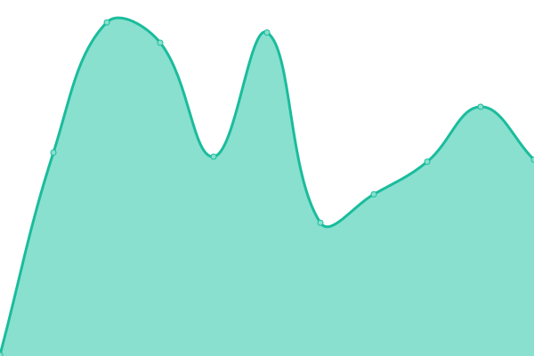
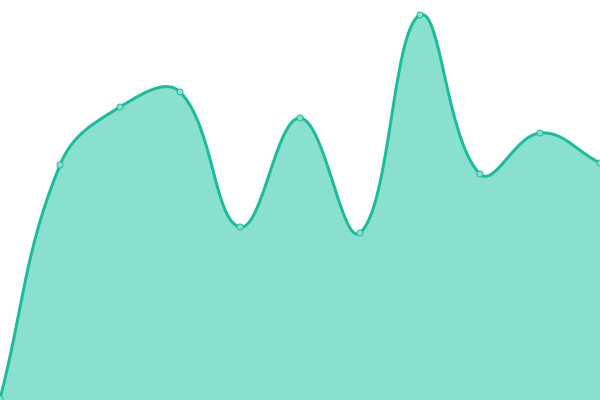
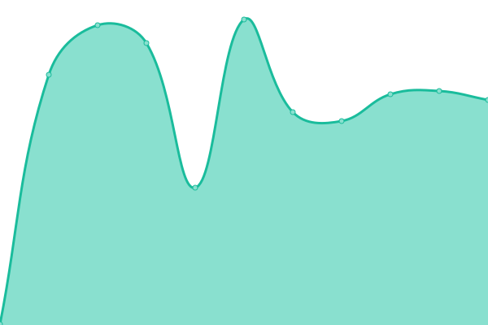
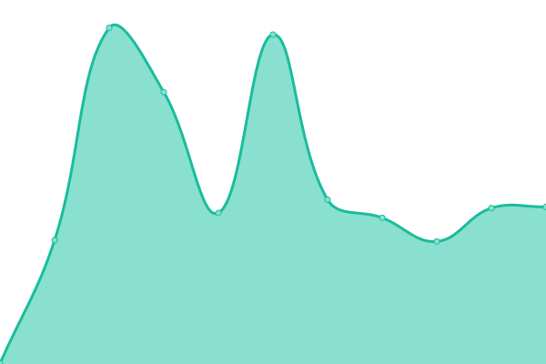
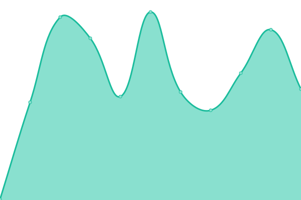

# [📈 Live Status](https://demo.upptime.js.org): <!--live status--> **🟧 Partial outage**

This repository contains the open-source uptime monitor and status page for [Upptime](https://upptime.js.org), powered by [Upptime](https://github.com/upptime/upptime).

With [Upptime](https://upptime.js.org), you can get your own unlimited and free uptime monitor and status page, powered entirely by a GitHub repository. We use [Issues](https://github.com/upptime/upptime/issues) as incident reports, [Actions](https://github.com/upptime/upptime/actions) as uptime monitors, and [Pages](https://demo.upptime.js.org) for the status page.

<!--start: status pages-->
<!-- This summary is generated by Upptime (https://github.com/upptime/upptime) -->
<!-- Do not edit this manually, your changes will be overwritten -->
<!-- prettier-ignore -->
| URL | Status | History | Response Time | Uptime |
| --- | ------ | ------- | ------------- | ------ |
| [100diasdeverano](https://100diasdeverano.com) | 🟥 Down | [100diasdeverano.yml](https://github.com/compusam/upckmonitor/commits/master/history/100diasdeverano.yml) | 

 246ms
     
 | 

   

| [Agristarcontigo](https://agristarcontigo.com) | 🟩 Up | [agristarcontigo.yml](https://github.com/compusam/upckmonitor/commits/master/history/agristarcontigo.yml) | 

 211ms
     
 | 

   

| [CelebraconCRE](https://celebraconcre.com) | 🟩 Up | [celebracon-cre.yml](https://github.com/compusam/upckmonitor/commits/master/history/celebracon-cre.yml) | 

 2173ms
     
 | 

   

| [Circulodehonorapp](https://circulodehonorapp.com) | 🟩 Up | [circulodehonorapp.yml](https://github.com/compusam/upckmonitor/commits/master/history/circulodehonorapp.yml) | 

 504ms
     
 | 

   

| [Clubdeganadoresmayoreo](https://clubdeganadoresmayoreo.com) | 🟩 Up | [clubdeganadoresmayoreo.yml](https://github.com/compusam/upckmonitor/commits/master/history/clubdeganadoresmayoreo.yml) | 

 255ms
     
 | 

   

| [CNV](https://circulodehonorpepsico.com) | 🟩 Up | [cnv.yml](https://github.com/compusam/upckmonitor/commits/master/history/cnv.yml) | 

 434ms
     
 | 

   

| [Conexionescollins](https://conexionescollins.com) | 🟩 Up | [conexionescollins.yml](https://github.com/compusam/upckmonitor/commits/master/history/conexionescollins.yml) | 

 234ms
     
 | 

   

| [Contpaqistore](https://contpaqistore.com) | 🟩 Up | [contpaqistore.yml](https://github.com/compusam/upckmonitor/commits/master/history/contpaqistore.yml) | 

 216ms
     
 | 

   

| [DbaRewards](https://dbarewards.com) | 🟩 Up | [dba-rewards.yml](https://github.com/compusam/upckmonitor/commits/master/history/dba-rewards.yml) | 

 261ms
     
 | 

   

| [DesafioPepsico](https://desafiopepsico.com) | 🟩 Up | [desafio-pepsico.yml](https://github.com/compusam/upckmonitor/commits/master/history/desafio-pepsico.yml) | 

 207ms
     
 | 

   

| [Diageobaracademy](https://diageobaracademymexico.com) | 🟩 Up | [diageobaracademy.yml](https://github.com/compusam/upckmonitor/commits/master/history/diageobaracademy.yml) | 

 149ms
     
 | 

   

| [Enlacechopo](https://enlacechopo.com.mx) | 🟩 Up | [enlacechopo.yml](https://github.com/compusam/upckmonitor/commits/master/history/enlacechopo.yml) | 

 240ms
     
 | 

   

| [Erewardsmx](https://erewardsmx.com) | 🟩 Up | [erewardsmx.yml](https://github.com/compusam/upckmonitor/commits/master/history/erewardsmx.yml) | 

 953ms
     
 | 

   

| [GMF](https://clubroyalelite.com) | 🟩 Up | [gmf.yml](https://github.com/compusam/upckmonitor/commits/master/history/gmf.yml) | 

 245ms
     
 | 

   

| [Honorpremia](https://honorpremia.com) | 🟩 Up | [honorpremia.yml](https://github.com/compusam/upckmonitor/commits/master/history/honorpremia.yml) | 

 537ms
     
 | 

   

| [Jacto](https://jactopremios.com) | 🟥 Down | [jacto.yml](https://github.com/compusam/upckmonitor/commits/master/history/jacto.yml) | 

 680ms
     
 | 

   

| [Liberatubelleza](https://liberatubelleza.com.mx) | 🟩 Up | [liberatubelleza.yml](https://github.com/compusam/upckmonitor/commits/master/history/liberatubelleza.yml) | 

 297ms
     
 | 

   

| [Lidereshell](https://liderescs.com.mx) | 🟥 Down | [lidereshell.yml](https://github.com/compusam/upckmonitor/commits/master/history/lidereshell.yml) | 

 0ms
     
 | 

   

| [Lubechampions](https://lubechampions.com.mx) | 🟩 Up | [lubechampions.yml](https://github.com/compusam/upckmonitor/commits/master/history/lubechampions.yml) | 

 235ms
     
 | 

   

| [Mayre](https://recompensasmayre.com) | 🟩 Up | [mayre.yml](https://github.com/compusam/upckmonitor/commits/master/history/mayre.yml) | 

 273ms
     
 | 

   

| [Motivale](http://motivale.com) | 🟩 Up | [motivale.yml](https://github.com/compusam/upckmonitor/commits/master/history/motivale.yml) | 

 470ms
     
 | 

   

| [Premianavidad](https://premianavidadpepsico.com) | 🟥 Down | [premianavidad.yml](https://github.com/compusam/upckmonitor/commits/master/history/premianavidad.yml) | 

 0ms
     
 | 

   

| [Programaclubdeganadores](https://programaclubdeganadores.com) | 🟩 Up | [programaclubdeganadores.yml](https://github.com/compusam/upckmonitor/commits/master/history/programaclubdeganadores.yml) | 

 246ms
     
 | 

   

| [Programapremianavidad](https://programapremianavidad.com) | 🟥 Down | [programapremianavidad.yml](https://github.com/compusam/upckmonitor/commits/master/history/programapremianavidad.yml) | 

 0ms
     
 | 

   

| [Programasocioestrella](https://programasocioestrella.com) | 🟩 Up | [programasocioestrella.yml](https://github.com/compusam/upckmonitor/commits/master/history/programasocioestrella.yml) | 

 322ms
     
 | 

   

| [Promoshopclarios](https://promoshopclarios.com.mx) | 🟩 Up | [promoshopclarios.yml](https://github.com/compusam/upckmonitor/commits/master/history/promoshopclarios.yml) | 

 222ms
     
 | 

   

| [Raisingthebar](https://raisingthebarmexico.mx) | 🟩 Up | [raisingthebar.yml](https://github.com/compusam/upckmonitor/commits/master/history/raisingthebar.yml) | 

 218ms
     
 | 

   

| [Recibetucodigo](https://recibetucodigo.com) | 🟩 Up | [recibetucodigo.yml](https://github.com/compusam/upckmonitor/commits/master/history/recibetucodigo.yml) | 

 289ms
     
 | 

   

| [Recompensamostulealtad](https://recompensamostulealtad.com) | 🟩 Up | [recompensamostulealtad.yml](https://github.com/compusam/upckmonitor/commits/master/history/recompensamostulealtad.yml) | 

 226ms
     
 | 

   

| [Redrewards](https://redrewards.mx) | 🟩 Up | [redrewards.yml](https://github.com/compusam/upckmonitor/commits/master/history/redrewards.yml) | 

 278ms
     
 | 

   

| [SocioPepsico](https://sociopepsicomexico.com) | 🟩 Up | [socio-pepsico.yml](https://github.com/compusam/upckmonitor/commits/master/history/socio-pepsico.yml) | 

 1621ms
     
 | 

   

| [Spionline](https://spi-online.com) | 🟥 Down | [spionline.yml](https://github.com/compusam/upckmonitor/commits/master/history/spionline.yml) | 

 0ms
     
 | 

   

| [SuperacionJD](https://superacionjd.com) | 🟥 Down | [superacion-jd.yml](https://github.com/compusam/upckmonitor/commits/master/history/superacion-jd.yml) | 

 0ms
     
 | 

   

| [Urreapremia](https://urreapremia.com) | 🟩 Up | [urreapremia.yml](https://github.com/compusam/upckmonitor/commits/master/history/urreapremia.yml) | 

 348ms
     
 | 

   

<!--end: status pages-->

[**Visit our status website →**](https://demo.upptime.js.org)

## 📄 License

- Code: [MIT](./LICENSE) © [Upptime](https://upptime.js.org)
- Data in the `./history` directory: [Open Database License](https://opendatacommons.org/licenses/odbl/1-0/)
